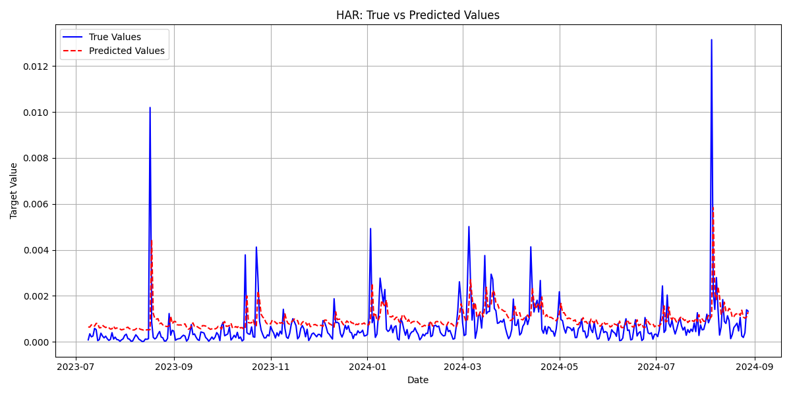

# Previsão de Volatilidade do Bitcoin usando Modelos Estatísticos e Deep Learning

## Autor
André Pennini  

## Resumo
Este relatório apresenta os resultados parciais de um experimento cujo objetivo é prever a volatilidade realizada do Bitcoin utilizando modelos estatísticos tradicionais e arquiteturas baseadas em Deep Learning. Foram avaliados três modelos principais: HAR-RV, PatchTST com pesos pré-treinados da IBM e PatchTST com fine-tuning dos pesos da IBM. Um quarto modelo PatchTST treinado do zero encontra-se em desenvolvimento. Os modelos foram comparados utilizando métricas padrão de regressão e análise visual das previsões.

---

## 1. Introdução

A previsão de volatilidade é um problema central em finanças quantitativas, sendo essencial para gestão de risco, precificação de derivativos e alocação de portfólio. No mercado de criptomoedas, caracterizado por alta variabilidade e não estacionariedade, este problema se torna ainda mais desafiador.

O objetivo deste trabalho é comparar um modelo econométrico clássico (HAR-RV) com modelos baseados em Deep Learning da família PatchTST para previsão de volatilidade do Bitcoin.

---

## 2. Base de Dados

- Ativo: Bitcoin (BTC)
- Frequência: intradiária de 5 minutos
- 📅 Período:
    - Início : 01/12/2017
    - Fim    : 01/12/2024
    - Duração: 7 anos e 2 dias (2557 dias no total)
- Target: Volatilidade realizada (Realized Volatility)

### 2.1 Pré-processamento

- Cálculo da volatilidade realizada
- Divisão temporal:
  - Treino: 70%
  - Validação: 10%
  - Teste: 20%
- Normalização / padronização

---

## 3. Modelos Avaliados

### 3.1 HAR-RV
Modelo econométrico baseado em componentes de volatilidade diária, semanal e mensal.

### 3.2 PatchTST - Base IBM
Modelo PatchTST utilizando pesos pré-treinados disponibilizados pela IBM.

### 3.3 PatchTST - Fine-tuned IBM
Modelo PatchTST inicializado com pesos da IBM e ajustado no dataset de volatilidade.

### 3.4 PatchTST - From Scratch (Em desenvolvimento)
Modelo PatchTST treinado do zero, sem uso de pesos pré-treinados.

---

## 4. Métricas de Avaliação

Foram utilizadas as seguintes métricas:

- Mean Squared Error (MSE)
- Mean Absolute Error (MAE)
- Root Mean Squared Error (RMSE)
- Mean Absolute Percentage Error (MAPE)

---

## 5. Resultados

### 5.1 Tabela Comparativa

| Modelo | MSE | MAE | RMSE | MAPE |
|------|-----|-----|------|----------|
| HAR-RV | 1.10e-06 | 5.92e-04 | 1.049e-03 | 254.14 |
| PatchTST IBM | 1.14e-06 | 6.19e-04 | 1.07e-03 | 313.70 |
| PatchTST Fine-tuned | 1.097e-06 | 5.32e-04 | 1.047e-03 | 256.24 |
| PatchTST From Scratch | (em breve) | (em breve) | (em breve) | (em breve) |

---

### 5.2 Gráficos – Real vs Predito

#### HAR-RV

#### PatchTST IBM

#### PatchTST Fine-tuned

---

## 6. Análise dos Resultados

- O modelo PatchTST Fine-tuned apresentou melhor desempenho em 3 das 4 métricas. Porém, ao analisar os gráficos de comportamento, o modelo fez predições mais lineares e menos voláteis do que o HAR-RV.

---

## 8. Limitações

- Dataset restrito a um único ativo
- Avaliação em um único horizonte de previsão
- Modelo from scratch ainda não finalizado

---

## 9. Trabalhos Futuros

- Finalizar PatchTST from scratch
- Tunning dos hiperparâmetros
- Avaliar múltiplos horizontes
- Adicionar mais ativos (ETH, SOL)

---

## 10. Conclusão

Este estudo inicial sugere que modelos PatchTST com fine-tuning oferecem ganhos relevantes na previsão de volatilidade do Bitcoin, sendo promissores para aplicações em gestão de risco e trading quantitativo.

---

## Referências

(Adicionar artigos do HAR-RV, PatchTST, Transformers em séries temporais)
